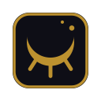

<p align="center"></p>

# Nocturne

A Chrome extension that seals the feeds that eat your time — YouTube recommendations and the X timeline — behind a deliberate checkpoint. Free at night.

## Features

- **YouTube** — recommended videos are blanked out. Music (videos YouTube marks with ♪, or from official artist channels), playlists, and mixes still work — except live streams
- **X** — the home timeline, Explore, and sidebar trends are sealed. Notifications, DMs, profiles, posts, and posting still work
- **Night** — off from 19:30 to 05:00, or keep the seal on for the night from the popup
- **Breaking the seal** — takes a dedicated window that grows more menacing the longer you ask for; doing it again soon makes you wait longer each time. While it's broken, the toolbar icon's eye stays open

## Install

1. Download the zip from [Releases](../../releases) and unzip it
2. Open `chrome://extensions`, turn on **Developer mode**, then **Load unpacked** and pick the folder

To update, replace the folder with a newer release and press ↻ on the extension card.

## Development

Requires [bun](https://bun.sh).

```bash
bun install
bun run dev         # auto-reloading dev build → load dist/chrome-mv3-dev
bun run build       # production build → dist/chrome-mv3
bun run test        # unit tests
bun run type-check
```

Enable only one of the dev / production builds at a time; they keep separate state.

To release, bump `version` in `package.json` and push a matching `vX.Y.Z` tag — CI publishes the zip. Branching and versioning: [`.claude/rules/git.md`](.claude/rules/git.md).

## Notes

- Depends on YouTube's and X's current page structure; site changes can break it until the selectors in `src/styles/` are updated
- Music detection relies on YouTube's own ♪ badge and official artist label (Japanese / English UI); music YouTube doesn't mark stays blocked
- Everything stays in your browser (extension local storage)
- Not affiliated with Google, YouTube, or X Corp.

## License

[MIT](LICENSE)
